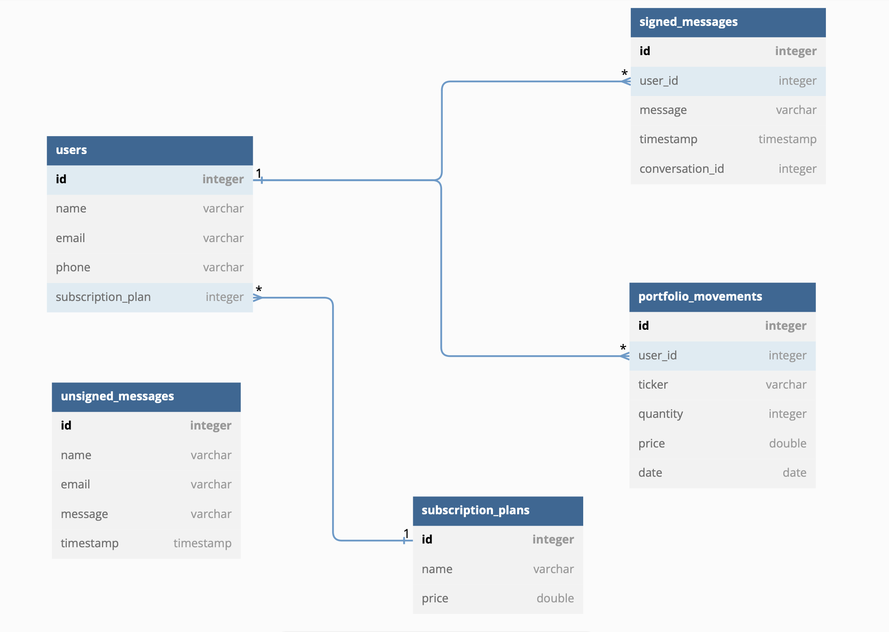

# Stockify

# Práctica 5:

En esta práctica se ha implementado una base de datos SQL gracias al DBMS H2. Además, se han incluido pruebas unitarias para probar los controller de las APIs para verificar el correcto funcionamiento de las mismas.

## Puntos adicionales:
Se han usado varios puntos adicionales en esta práctica:

### Transacciones:

Hemos implementado también un `@Transactional` para garantizar que la operación de guardar todos los movimientos de cartera en la base de datos se realice como una transacción atómica. El uso de `@Transactional` asegura que todos los movimientos se agreguen correctamente a la base de datos, o en caso de cualquier error, se revierta la transacción, evitando así estados inconsistentes en la base de datos.

La anotación `@Transactional` en el método `saveAllMovements()` del repositorio tiene el siguiente propósito:

1. **Atomicidad**: Si alguno de los movimientos no se guarda correctamente en la base de datos (por ejemplo, debido a restricciones de integridad), se revertirá toda la transacción y no se guardarán ninguno de los movimientos. Esto garantiza que la base de datos siempre esté en un estado consistente y no haya movimientos parciales guardados.

2. **Aislamiento**: La anotación `@Transactional` también garantiza que la operación se ejecute con un cierto nivel de aislamiento de otras transacciones concurrentes. Dependiendo de la configuración y el motor de la base de datos, esto puede incluir la prevención de lecturas sucias, lecturas no repetibles y/o fantasmas.

3. **Gestión de errores**: Si ocurre un error durante la ejecución de la transacción, Spring manejará automáticamente el proceso de deshacer los cambios y lanzará una excepción. Esto simplifica el manejo de errores en el código del servicio, ya que no es necesario manejar explícitamente el proceso de reversión de la transacción.

En resumen, al utilizar la anotación `@Transactional` en nuestro método `saveAllMovements()`, nos aseguramos de que todos los movimientos se guarden de manera atómica y segura en la base de datos, evitando posibles problemas de consistencia y simplificando el manejo de errores.

### Queries SQL avanzadas:

1. Método `findLatestMessagesByUserId(Integer userId)`:

Este método devuelve una lista de el mensaje más recientes de cada conversación asociada con un usuario específico, identificado por su `userId`.

La consulta SQL utilizada en este método es una subconsulta correlacionada. Primero, se seleccionan el `CONVERSATION_ID` y el `MAX(TIMESTAMP)` de la tabla `SIGNED_MESSAGES` agrupados por `CONVERSATION_ID`, solo para las filas que coinciden con el `USER_ID` especificado. Luego, se realiza una unión (JOIN) de los resultados con la tabla `SIGNED_MESSAGES` utilizando las condiciones de que `CONVERSATION_ID` y `TIMESTAMP` sean iguales. Finalmente, se filtran los resultados para obtener solo las filas con el `USER_ID` especificado.

El uso de esta consulta compleja permite obtener los últimos mensajes de cada conversación del usuario de manera eficiente y con una sola consulta a la base de datos.

`SELECT t1.* FROM SIGNED_MESSAGES AS t1 JOIN (SELECT CONVERSATION_ID, MAX(TIMESTAMP) as MAX_TIMESTAMP FROM SIGNED_MESSAGES WHERE USER_ID = ? GROUP BY CONVERSATION_ID) AS t2 ON t1.CONVERSATION_ID = t2.CONVERSATION_ID AND t1.TIMESTAMP = t2.MAX_TIMESTAMP WHERE t1.USER_ID = ?`

2. Método `findLastConversationId()`:

Este método devuelve el último `CONVERSATION_ID` en la tabla `SIGNED_MESSAGES`.

La consulta SQL utilizada en este método es una agregación simple, utilizando la función `MAX()` para encontrar el valor máximo de `CONVERSATION_ID` en la tabla `SIGNED_MESSAGES`. Aunque esta consulta no es tan compleja como la anterior, sigue siendo importante mencionarla en la documentación, ya que es esencial para la funcionalidad del sistema. 

`SELECT MAX(CONVERSATION_ID) FROM SIGNED_MESSAGES`

## Bases de datos creadas:
Para representar las bases de datos creadas hemos creado el diagrama que se puede ver a continuación:
 

 A continuación, se presenta la documentación de las bases de datos en forma de una lista con las tablas creadas y los campos correspondientes:

1. Tabla SUBSCRIPTION_PLANS (Tabla de planes de suscripción de pago):
   - ID (INT, NOT NULL, AUTO_INCREMENT): Identificador único de cada plan de suscripción.
   - NAME (VARCHAR(255), NOT NULL): Nombre del plan de suscripción.
   - PRICE (DOUBLE, NOT NULL): Precio del plan de suscripción.

2. Tabla USERS (Tabla de los datos personales de los usuarios):
   - ID (INT, NOT NULL, AUTO_INCREMENT): Identificador único de cada usuario.
   - NAME (VARCHAR(255), NOT NULL): Nombre del usuario.
   - EMAIL (VARCHAR(255), NOT NULL): Correo electrónico del usuario.
   - PHONE (VARCHAR(255), NOT NULL): Teléfono del usuario.
   - SUBSCRIPTION_PLAN (INT, NOT NULL): Identificador del plan de suscripción al que está suscrito el usuario (clave foránea que hace referencia a la tabla SUBSCRIPTION_PLANS).

3. Tabla SIGNED_MESSAGES (Tabla de los mensajes de contacto de los usuarios ya registrados en la aplicación):
   - ID (INT, NOT NULL, AUTO_INCREMENT): Identificador único de cada mensaje firmado.
   - USER_ID (INT, NOT NULL): Identificador del usuario que envía el mensaje (clave foránea que hace referencia a la tabla USERS).
   - MESSAGE (VARCHAR(255), NOT NULL): Contenido del mensaje.
   - TIMESTAMP (TIMESTAMP, NOT NULL): Fecha y hora en la que se envió el mensaje.
   - CONVERSATION_ID (INT, NOT NULL): Identificador de la conversación a la que pertenece el mensaje.

4. Tabla UNSIGNED_MESSAGES (Tabla de los mensajes de contacto de los usuarios no registrados en la aplicación):
   - ID (INT, NOT NULL, AUTO_INCREMENT): Identificador único de cada mensaje sin firmar.
   - NAME (VARCHAR(255), NOT NULL): Nombre del remitente del mensaje.
   - EMAIL (VARCHAR(255), NOT NULL): Correo electrónico del remitente del mensaje.
   - MESSAGE (VARCHAR(255), NOT NULL): Contenido del mensaje.
   - TIMESTAMP (TIMESTAMP, NOT NULL): Fecha y hora en la que se envió el mensaje.

5. Tabla PORTFOLIO_MOVEMENTS (Tabla de los movimientos del portafolio de los usuarios, es decir, las compras y ventas de instrumentos financieros):
   - ID (INT, NOT NULL, AUTO_INCREMENT): Identificador único de cada movimiento del portafolio.
   - USER_ID (INT, NOT NULL): Identificador del usuario asociado al movimiento del portafolio (clave foránea que hace referencia a la tabla USERS).
   - TICKER (VARCHAR(255), NOT NULL): Símbolo de cotización (ticker) del instrumento financiero.
   - QUANTITY (INT, NOT NULL): Cantidad de instrumentos involucrados en el movimiento.
   - PRICE (DOUBLE, NOT NULL): Precio del instrumento financiero en el momento del movimiento.
   - DATE (DATE, NOT NULL): Fecha del movimiento del portafolio.
 

## Endpoints de la API:

A continuación se presenta la documentación de los endpoints de las APIs proporcionadas:

### PortfolioController

1. **GET /portfolio/{userID}**

   Obtiene el portafolio del usuario especificado por el ID de usuario.

   - Parámetros de ruta:
     - `userID`: ID del usuario (Integer)

   - Respuestas:
     - `200 OK`: Si se encuentra el portafolio del usuario.
     - `400 BAD_REQUEST`: Si ocurre un error al obtener el portafolio.
     - `500 INTERNAL_SERVER_ERROR`: Si ocurre un error inesperado.

2. **POST /movement**

   Añade un nuevo movimiento al portafolio.

   - Parámetros de cuerpo (JSON):
     - `payload`: Objeto PortfolioMovement

   - Respuestas:
     - `200 OK`: Si se añade correctamente el movimiento.
     - `400 BAD_REQUEST`: Si ocurre un error al añadir el movimiento.
     - `500 INTERNAL_SERVER_ERROR`: Si ocurre un error inesperado.

3. **POST /upload**

   Sube y procesa un archivo CSV con movimientos del portafolio.

   - Parámetros de formulario:
     - `file`: Archivo CSV (MultipartFile)

   - Respuestas:
     - `200 OK`: Si se sube y procesa correctamente el archivo.
     - `500 INTERNAL_SERVER_ERROR`: Si falla la subida o el procesamiento del archivo.

4. **GET /download/{userID}**

   Descarga el archivo CSV con los movimientos del portafolio del usuario especificado por el ID de usuario.

   - Parámetros de ruta:
     - `userID`: ID del usuario (Integer)

   - Respuestas:
     - `200 OK`: Si se descarga correctamente el archivo.
     - `404 NOT_FOUND`: Si no se encuentra el archivo.
     - `500 INTERNAL_SERVER_ERROR`: Si falla la descarga del archivo.

5. **POST /movement/update**

   Actualiza un movimiento existente en el portafolio.

   - Parámetros de cuerpo (JSON):
     - `payload`: Objeto PortfolioMovement

   - Respuestas:
     - `200 OK`: Si se actualiza correctamente el movimiento.
     - `400 BAD_REQUEST`: Si ocurre un error al actualizar el movimiento.
     - `500 INTERNAL_SERVER_ERROR`: Si ocurre un error inesperado.

6. **GET /movement/{movementID}**

   Obtiene un movimiento específico del portafolio.

   - Parámetros de ruta:
     - `movementID`: ID del movimiento (Integer)

   - Respuestas:
     - `200 OK`: Si se encuentra el movimiento.
     - `400 BAD_REQUEST`: Si ocurre un error al obtener el movimiento.
     - `500 INTERNAL_SERVER_ERROR`: Si ocurre un error inesperado.

7. **DELETE /movement/{movementID}**

   Elimina un movimiento específico del portafolio.

   - Parámetros de ruta:
     - `movementID`: ID del movimiento (Integer)

   - Respuestas:
     - `200 OK`: Si se elimina correctamente el movimiento.
     - `500 INTERNAL_SERVER_ERROR`: Si ocurre un error inesperado.

### SignedMessageController

1. **POST /signedMessages**

   Añade un mensaje firmado.

   - Parámetros de cuerpo (JSON):
     - `signedMessageDTO`: Objeto SignedMessageDTO

   - Respuestas:
     - `200 OK`: Si se añade correctamente el mensaje firmado.
     - `400 BAD_REQUEST`: Si ocurre un error al añadir el mensaje firmado.
     - `500 INTERNAL_SERVER_ERROR`: Si ocurre un error inesperado.

2. **GET /lastConversationId**

   Obtiene el último ID de conversación.

   - Respuestas:
     - `200 OK`: Si se obtiene correctamente el último ID de conversación.

3. **GET /signedMessages/{conversationId}**

   Obtiene los mensajes firmados de una conversación específica.

   - Parámetros de ruta:
     - `conversationId`: ID de la conversación (Integer)

   - Respuestas:
     - `200 OK`: Si se obtienen correctamente los mensajes firmados.
     - `400 BAD_REQUEST`: Si ocurre un error al obtener los mensajes firmados.
     - `500 INTERNAL_SERVER_ERROR`: Si ocurre un error inesperado.

4. **GET /signedMessages/latest/{userId}**

   Obtiene los últimos mensajes firmados del usuario especificado por el ID de usuario.

   - Parámetros de ruta:
     - `userId`: ID del usuario (Integer)

   - Respuestas:
     - `200 OK`: Si se obtienen correctamente los últimos mensajes firmados.
     - `400 BAD_REQUEST`: Si ocurre un error al obtener los últimos mensajes firmados.
     - `500 INTERNAL_SERVER_ERROR`: Si ocurre un error inesperado.

### SuscriptionPlanController

1. **GET /suscriptionPlans/{suscriptionPlanID}**

   Obtiene información del plan de suscripción especificado por el ID de suscripción.

   - Parámetros de ruta:
     - `suscriptionPlanID`: ID del plan de suscripción (Integer)

   - Respuestas:
     - `200 OK`: Si se obtiene correctamente la información del plan de suscripción.

2. **GET /subscriptionPlans**

   Obtiene todos los planes de suscripción.

   - Respuestas:
     - `200 OK`: Si se obtienen correctamente los planes de suscripción.

### UnsignedMessageController

1. **POST /contact**

   Añade un mensaje de contacto.

   - Parámetros de cuerpo (JSON):
     - `message`: Mapa con información del mensaje de contacto

   - Respuestas:
     - `200 OK`: Si se añade correctamente el mensaje de contacto.
     - `400 BAD_REQUEST`: Si ocurre un error al añadir el mensaje de contacto.
     - `500 INTERNAL_SERVER_ERROR`: Si ocurre un error inesperado.

### UserController

1. **GET /users/{userID}**

   Obtiene información del usuario especificado por el ID de usuario.

   - Parámetros de ruta:
     - `userID`: ID del usuario (Integer)

   - Respuestas:
     - `200 OK`: Si se obtiene correctamente la información del usuario.

2. **POST /users**

   Añade un nuevo usuario.

   - Parámetros de cuerpo (JSON):
     - `user`: Objeto User

   - Respuestas:
     - `200 OK`: Si se añade correctamente el usuario.
     - `400 BAD_REQUEST`: Si ocurre un error al añadir el usuario.
     - `500 INTERNAL_SERVER_ERROR`: Si ocurre un error inesperado.

## Tests unitarios:

- SignedMessageControllerTest:
    - addSignedMessage_shouldReturnOk_whenValidMessage: Comprueba que se devuelve una respuesta con estado OK (200) cuando se añade un mensaje válido.
    - addSignedMessage_shouldReturnBadRequest_whenInvalidMessage: Comprueba que se devuelve una respuesta con estado Bad Request (400) cuando se intenta añadir un mensaje inválido.
    - addSignedMessage_shouldReturnInternalServerError_whenUnexpectedError: Comprueba que se devuelve una respuesta con estado Internal Server Error (500) cuando ocurre un error inesperado al añadir un mensaje.
    - getLastConversationId_shouldReturnOk: Comprueba que se devuelve una respuesta con estado OK (200) y un entero cuando se pide el último ID de conversación.
    - getSignedMessages_shouldReturnOk_whenValidConversationId: Comprueba que se devuelve una respuesta con estado OK (200) y una lista de mensajes cuando se pide una lista de mensajes para una ID de conversación válida.
    - getLatestMessagesByUserId_shouldReturnOk_whenValidUserId: Comprueba que se devuelve una respuesta con estado OK (200) y una lista de los últimos mensajes para un ID de usuario válido.
    - getSignedMessages_shouldReturnBadRequest_whenInvalidConversationId: Comprueba que se devuelve una respuesta con estado Bad Request (400) cuando se intenta obtener una lista de mensajes con un ID de conversación inválido.
    - getSignedMessages_shouldReturnInternalServerError_whenUnexpectedError: Comprueba que se devuelve una respuesta con estado Internal Server Error (500) cuando ocurre un error inesperado al obtener una lista de mensajes.
    - addSignedMessage_shouldReturnBadRequest_whenRequiredFieldMissing: Comprueba que se devuelve una respuesta con estado Bad Request (400) cuando falta un campo requerido en el mensaje.

- SuscriptionPlanControllerTest:
    - getSuscriptionPlanInfo_shouldReturnSuscriptionPlanInfo: Comprueba que se devuelve una respuesta con estado OK (200) y los detalles del plan de suscripción correspondiente a un ID de plan válido.
    - getAllSuscriptionPlans_shouldReturnAllSuscriptionPlans: Comprueba que se devuelve una respuesta con estado OK (200) y una lista con todos los planes de suscripción disponibles.
    - getSuscriptionPlanInfo_shouldReturnBadRequest_whenInvalidId: Comprueba que se devuelve una respuesta con estado Bad Request (400) cuando se intenta obtener información de un plan de suscripción con un ID inválido.
    - getSuscriptionPlanInfo_shouldReturnInternalServerError_whenUnexpectedError: Comprueba que se devuelve una respuesta con estado Internal Server Error (500) cuando ocurre un error inesperado al obtener información de un plan de suscripción.

- UnsignedMessageControllerTest:
    - addContactMessage_shouldAddMessage: Comprueba que se devuelve una respuesta con estado OK (200) cuando se añade un mensaje de contacto.
    - addContactMessage_shouldReturnBadRequest_whenInvalidPayload: Comprueba que se devuelve una respuesta con estado Bad Request (400) cuando se intenta añadir un mensaje de contacto con datos inválidos.
    - addContactMessage_shouldReturnInternalServerError_whenUnexpectedError: Comprueba que se devuelve una respuesta con estado Internal Server Error (500) cuando ocurre un error inesperado al añadir un mensaje de contacto.

- UserControllerTest:
    - getUserInfo_shouldReturnUserInfo(): se prueba que se pueda obtener la información de un usuario existente a través de su ID. Se espera que el endpoint retorne un código de estado HTTP 200 y la información del usuario en formato JSON.

    - addUser_shouldAddUser(): se prueba que se pueda agregar un nuevo usuario a través del endpoint correspondiente. Se espera que el endpoint retorne un código de estado HTTP 200 y la información del usuario agregado en formato JSON.

    - addUser_shouldReturnBadRequest_whenInvalidData(): se prueba que el endpoint de agregar usuario retorne un código de estado HTTP 400 cuando se proporciona información inválida para el nuevo usuario.

    - addUser_shouldReturnInternalServerError_whenUnexpectedError(): se prueba que el endpoint de agregar usuario retorne un código de estado HTTP 500 cuando se produce un error inesperado al intentar agregar el nuevo usuario.

### MUY IMPORTANTE: USO:
Para usarlo hay que ejecutar el backend en el puerto 8080 (por defecto) para que funcione con el front. Como verá tengo el front y el backend en dos carpetas diferentes. Para ejecutar el backend hay que ponerse en la carpeta stockify-api. La web se puede acceder desde [aquí](https://carlos-ag.github.io/202010774-GITT-PAT-practica-5/Stockify/html/)

### IMPORTANTE:
Para ejecutar la API hace falta ponerse desde la carpeta stockify-api.
El frontend y el backend están separados (Stockify y stockify-api respectivamente)

## IMPORTANTE:
- API Noticias (100 noticias por día) (en principio *5 ya que he puesto 5 api keys diferentes)
- API Autocompletado (5 por minuto) compartidas con la API de cotización de acciones

### Introducción:
Está página web está siendo realizada en el cuadro de PROGRAMACIÓN DE APLICACIONES TELEMÁTICAS. 

La utilidad de la página es el de facilitar información al usuario sobre su cartera de acciones y permitirle en unos minutos tener un resumen de la evolución de esta en los últimos días/meses/años. 

La página web funciona tanto en ordenadores como en dispositivos móviles y además es responsive, es decir, se adapta al tamaño de la pantalla del dispositivo en el que se visualiza. Verá que los colores del header también cambian para que quede bonita en cualquier dispositivo.

Las técnologías usadas por el momento son HTML, CSS, Javascript, Python y Plotly, Java, Spring Boot, H2.

Para familiarizarnos con los frameworks, hemos incluido Bootstrap en la página de login.

También se ha usado SASS para facilitar el desarrollo de los archivos CSS. Para ello se ha usado la extensión de VSCode llamada Live Sass Compiler, que compila los archivos SASS a CSS en tiempo real. Se ha configurado esta extensión para que guarde los archivos en la carpeta CSS (y no en la carpeta SASS).

### Instalación:
Necesita un editor de texto como puede ser VSCode y un navegador para visualizar la página web.
Si lo desea para facilitar el desarrollo de la página web puede la extensión de VSCode llamada Live Server que sirve para ver en directo los cambios realizados en el HTML sin necesidad de recargar la página web. También recomendamos el uso de Live Sass Compiler para facilitar el desarrollo de los archivos CSS ya que compila los archivos SASS a CSS en tiempo real.
